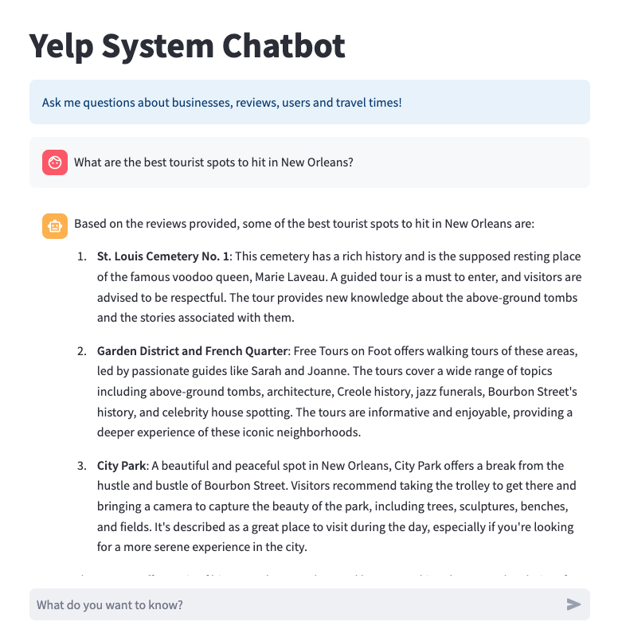

                This chatbot interfaces with a
                [LangChain](https://python.langchain.com/docs/get_started/introduction)
                agent designed to answer questions about a subset of users, businesses, 
                and reviews on [Yelp](https://www.yelp.com/). Dataset provided by [Yelp](https://www.yelp.com/dataset).
                The agent uses  retrieval-augment generation (RAG) over both
                structured and unstructured data. Data is hosted by [Neo4js](https://neo4j.com/) Graph Database Management System.
